# Usage Instructions

Eventually, users will be able to access the deployed application through either the Google Play Store or the Apple App Store.

However, given that the application is still in development, users wanting to try the application themselves have to follow the set up instructions below.


# Steps

### First Time Set-up

If you are trying to run the application locally for the first time, follow the instructions in the [Flutter Docs](https://docs.flutter.dev/get-started/install) to set up Flutter first.

### Clone the GitHub project

The following steps assumes basic knowledge in Git and scripting. If you are new, you may check out the documentations for [Git](https://git-scm.com/docs/user-manual) and [command prompt](https://www.digitalcitizen.life/command-prompt-how-use-basic-commands/).

1. Open terminal (or command prompt).
2. Navigate to your preferred project directory.
3. Clone the repo with the following.
  ```
  git clone https://github.com/anthonynmh/habit_tracker_app.git
  ```
4. Run the following code to download dependencies.
  ```
  flutter pub get
  ```
5. Open Visual Studio Code (or your preferred IDE).
6. If you are using a simulator, ensure that you have selected the correct simulator. Detailed instructions [here](https://docs.flutter.dev/tools/vs-code#selecting-a-target-device).
7. Run `lib/main.dart`.


# Usage Instructions

### First page 
When users first launch the application, they are immediately presented with the dashboard.

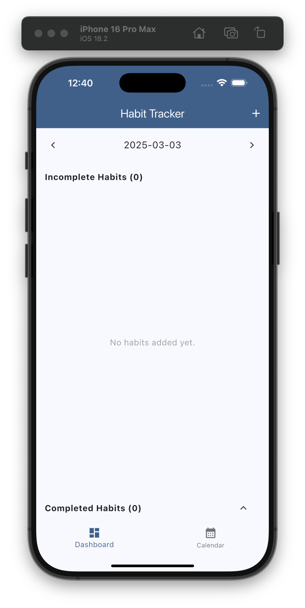


### Adding a habit to track

To add a habit to track, click on the add (**+**)  button in the top right.

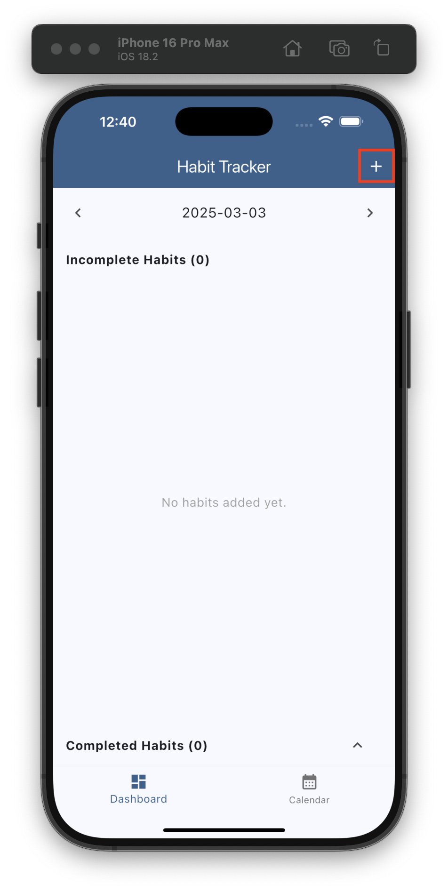

Update the habit information in the text fields. Note that **Habit Name** is a compulsory field, the description is optional. Tap 'Submit' to confirm the add.

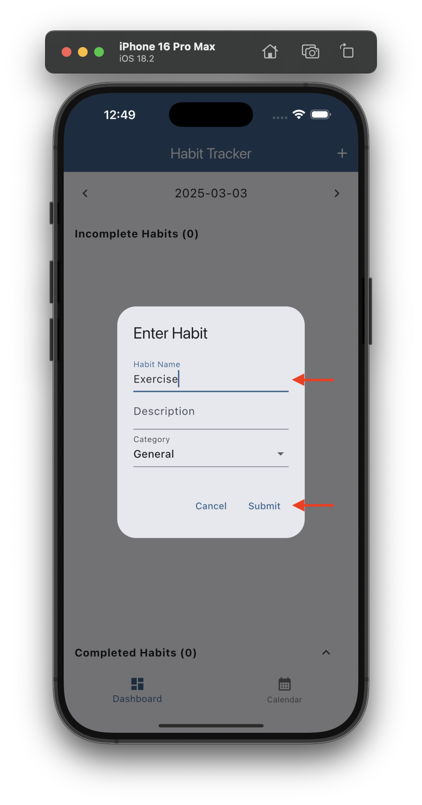


### Editing a habit

Added habits can be edited via the menu button. Tap on the triple-dot menu (**...**) and select edit.

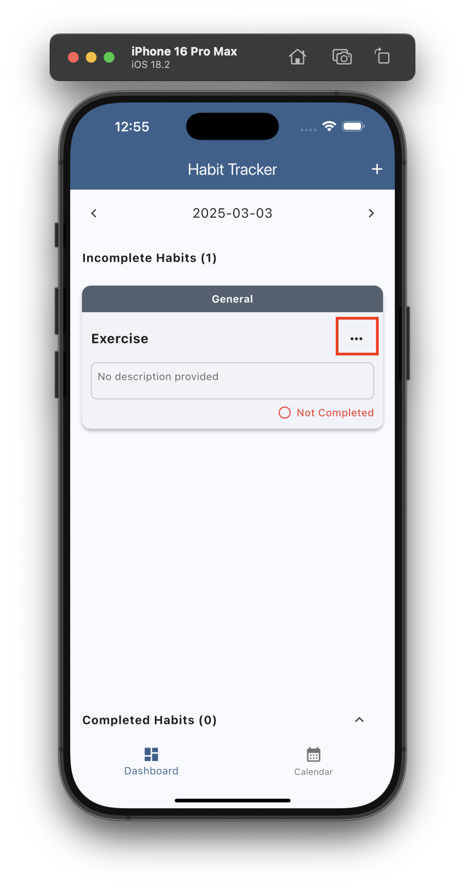

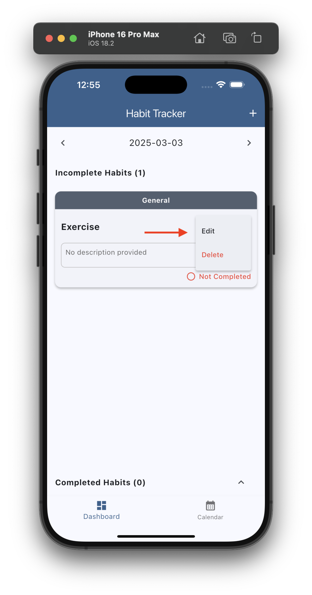

Tap 'Submit' to confirm the edit.

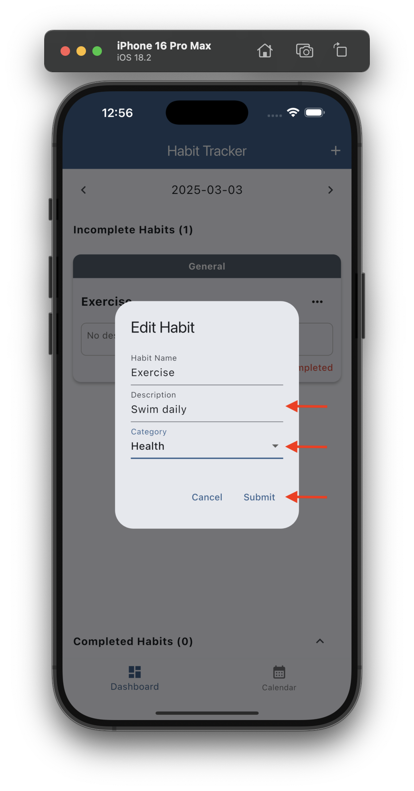

The habit now displays with the updated information.

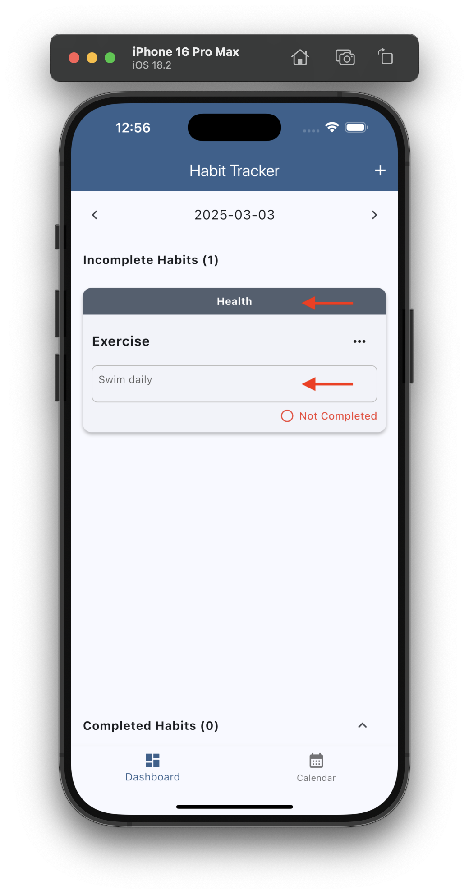

### Daily habit check-in

Users may tap on the 'Not Completed' text to mark it as completed for the current date.

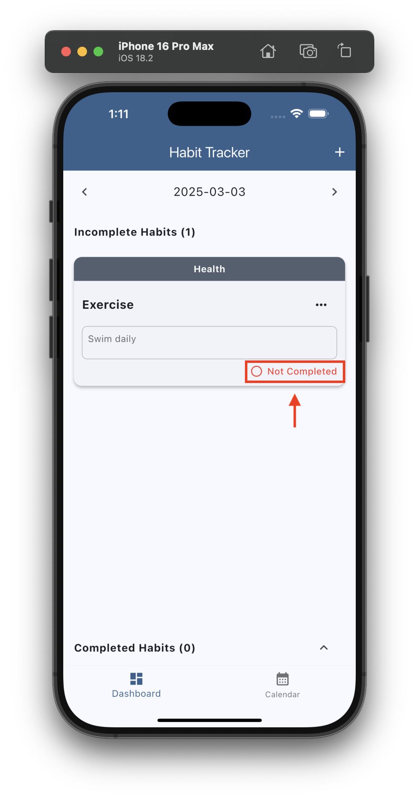

If the 'Completed Habits' section is collapsed, users may expand it using the arrow on the right of the section header.

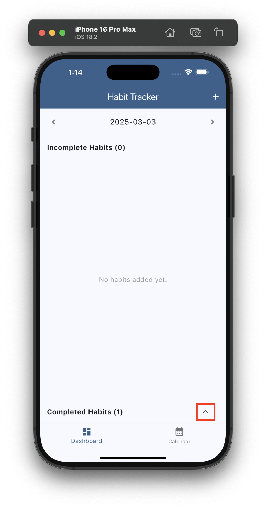

The completed habit check-in for the day should be viewable.

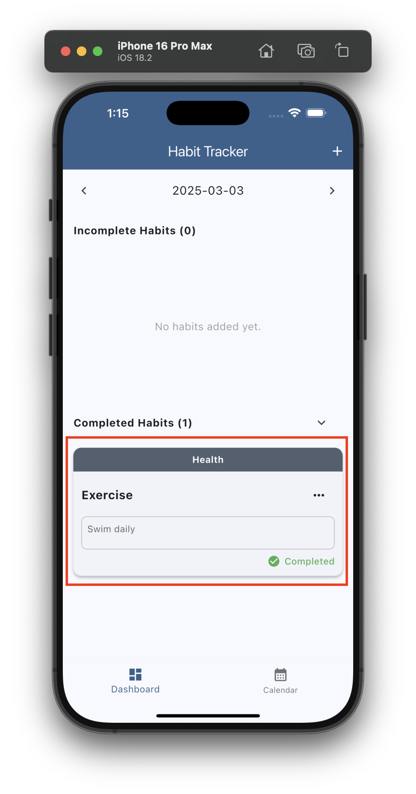

Completed habits are consolidated and viewable in the **Calendar** tab.

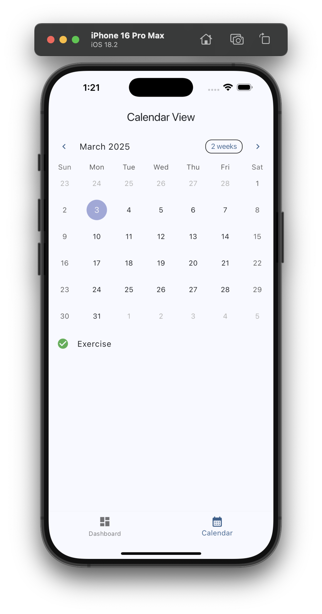


### Deleting a habit

Added habits can be edited via the menu button. Tap on the triple-dot menu (**...**) and select 'Delete'. 


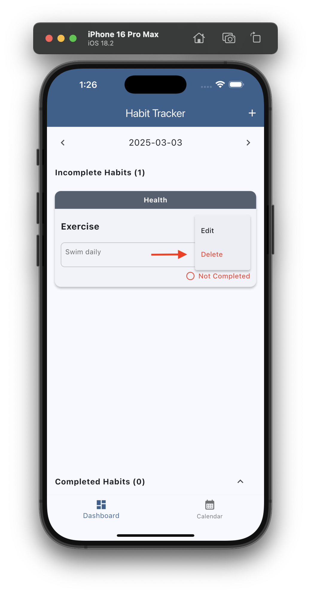

Tap 'Delete' to confirm the delete.

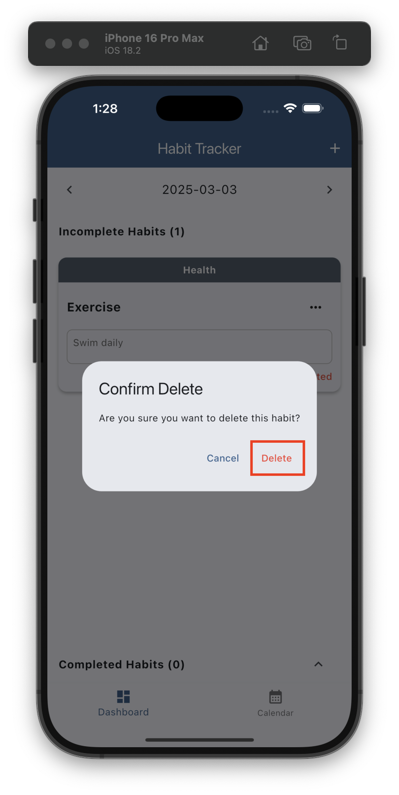
